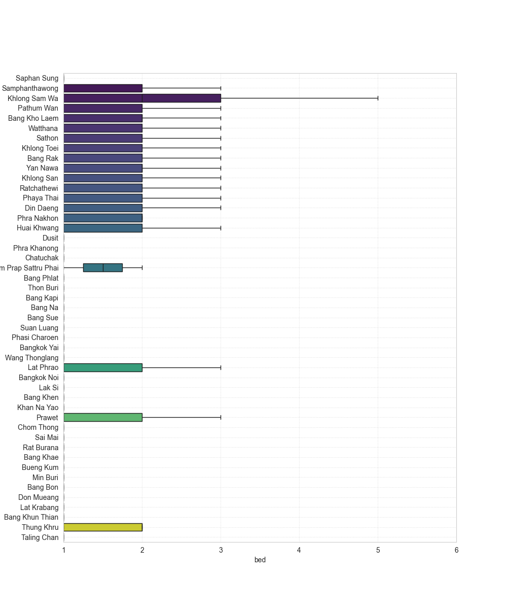

# Bangkok Condo Rental Market Analysis

This project analyzes condominium rental listings in Bangkok, Thailand. It uses data scraped (Aug 2025) from a ``redacted`` property website to explore trends in pricing, size, and location across various districts and specific condo projects.

The analysis is performed in the accompanying Jupyter Notebook: `bangkok_condo_rentals.ipynb`.

## Key Data Points
- **Price:** Rental price in Thai Baht (THB).
- **Area:** Size of the unit in square meters (sqm).
- **Location:** District, latitude, and longitude.
- **Features:** Number of bedrooms and bathrooms.

**Note:**
- Latitude and longitude are for districts and not for individual projects.
- Listings with 'nan' floor are defaulted to 1.

## Setup
The analysis requires the following Python libraries:
- `pandas`
- `matplotlib`
- `seaborn`
- `cartopy`
- `contextily`

## Visualizations

### Market Overview

**Listing Density by District**

A geographical heatmap showing the concentration of rental listings across Bangkok districts.

---

**Listings & Median Price by District**

This chart displays the total number of available listings for each district, with the median rental price overlaid as a diamond marker. It shows that districts like Watthana and Khlong Toei have the highest number of listings.

---

### Price & Size Distributions

**Distribution of Log(Price)**

The distribution of rental prices (log-transformed) after trimming the top and bottom 0.5% of outliers.

**Distribution of Log(Area)**

The distribution of unit sizes in square meters (log-transformed) after trimming outliers.

**Distribution of Log(THB/sqm)**
The distribution of price per square meter (log-transformed) after trimming outliers.

---

### Analysis by District

The following box plots show the distribution of key metrics for each district, sorted by the average value. This helps to compare the characteristics of different areas.

| Metric | Visualization |
| :--- | :--- |
| **Rent by District** |  |
| **Price per Sqm by District** |  |
| **Room Size by District** |  |
| **Bedrooms by District** |  |

---

### Top 20 Most Expensive Districts

These charts highlight the 20 districts with the highest average rental prices, both in absolute terms and per square meter. The number of available listings is also shown.

| Metric | Visualization |
| :--- | :--- |
| **By Average Rent** |  |
| **By Average THB/sqm** |  |

---

### Top 20 Most Affordable Districts

Conversely, these charts show the 20 most affordable districts.

| Metric | Visualization |
| :--- | :--- |
| **By Average Rent** |  |
| **By Average THB/sqm** |  |

---

### Analysis by Project

The analysis is also narrowed down to specific condominium projects with 10 or more listings.

**Top 20 Most Expensive Projects**
| Metric | Visualization |
| :--- | :--- |
| **By Avg Rent, Area & Listings** |  |
| **By Avg THB/sqm, Area & Listings** |  |

---

**Top 20 Most Affordable Projects**
| Metric | Visualization |
| :--- | :--- |
| **By Avg Rent, Area & Listings** |  |
| **By Avg THB/sqm, Area & Listings** |  |

---

### Feature Relationships

Scatter plots exploring the relationship between different features.

| Relationship | Visualization |
| :--- | :--- |
| **Price vs. Area** |  |
| **Price vs. Bedrooms (Trimmed)** |  |
